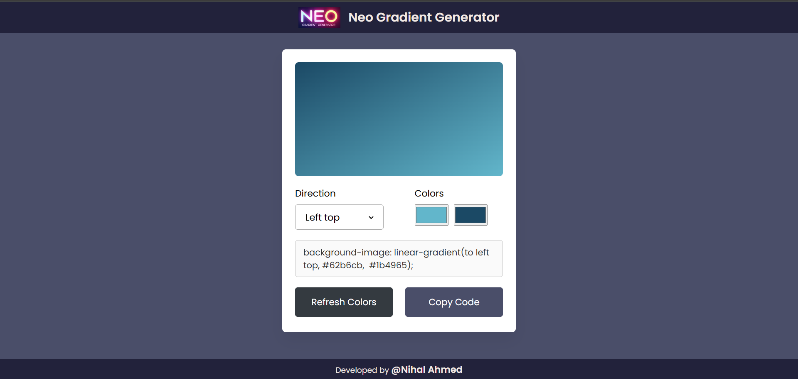

# 🎨 Neo Gradient Generator

**Neo Gradient Generator** is a sleek and modern web-based tool that allows users to generate custom CSS gradients with ease. Choose your direction, pick your colors, and copy the CSS code – all in one interactive interface.



## 🚀 Features

- 🎨 Live gradient preview
- 🔁 Random color generator
- ⬅️ 8 direction options for gradient flow
- 📋 One-click copy to clipboard
- 🌐 Responsive design
- 🖌️ Built with pure HTML, CSS, and JavaScript – no frameworks

## 🛠️ How to Use

1. **Clone or Download the Repository**

   ```bash
   git clone https://github.com/nihalahmed07/Gradient-Color-Generator-JavaScript.git
   cd neo-gradient-generator
   ```

2. **Open index.html in your browser**
   
   ```bash
   open index.html
   ```
   Or simply double-click on the file.

3. **Use the App**

   - Choose a gradient direction from the dropdown
   - Pick two colors using the color pickers
   - Click “Refresh Colors” to generate random colors
   - Copy the CSS gradient code to use in your own projects

4. **🌐 Live Demo**
   
   [Check it out here!](https://neo-gradientcolor.netlify.app/)

5. **🧑‍💻 Developer**

   Built with ❤️ by [Nihal Ahmed](https://nihalahmed.in/)


